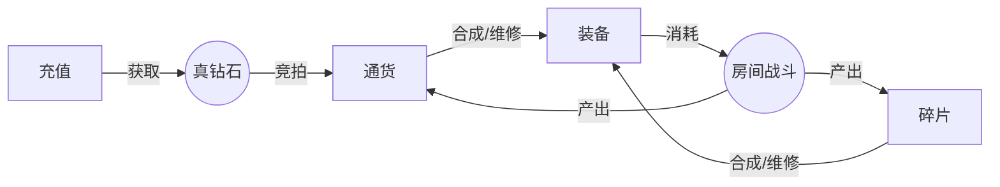
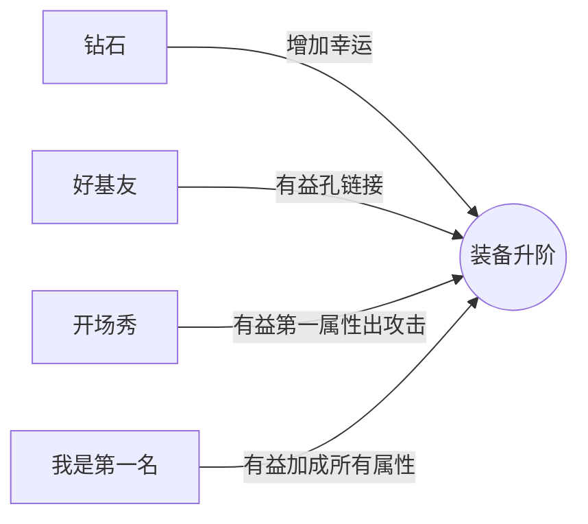
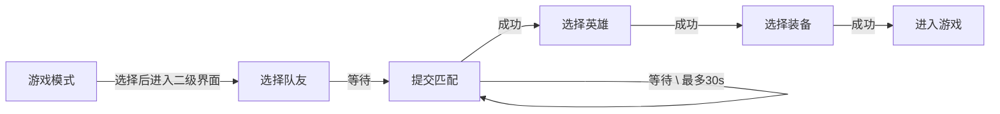
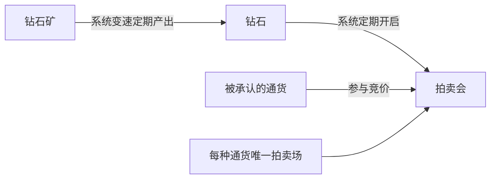

# 文字MUD游戏

<!-- TOC -->

## 仓库

存储玩家道具和标签货币

## 好友

好友多也是一种标签货币:)

## 邮件

系统发放使用

## 战队

影响房间战斗收益, 聊天频道

## 房间

游戏核心, 快乐的战斗之后, 产出各种标签货币、道具碎片, 战斗中只能和队友聊天(语音),
禁止一切机会和敌方聊天, 禁止串通作弊, 一旦出现奇怪的行动, 不攻击等, 视为作弊
对消极战斗, 全面给与惩罚, 全面给出打酱油, 评分低, 而且信用降低, 产生一次信用问题记录

## 大厅

各种系统的入口, 统计中心

## 标签货币

非常多, 从开服第一场战斗开始, 建立标签货币产出总值, 现存总值
货币的用途就是兑换钻石, 不管什么货币, 只要比上一个出价高(依据当时汇率), 就成功竞价
竞拍成功后, 规定时间内汇款, 否则流拍钻石回归拍卖场所
当前汇率是全服可见, 从最值钱的到最便宜的一次排列, 也就是总值从小到大排列, 每1分钟统计一次均值,
对于前面几种罕见货币, 进行录像审查, 审查后, 才能作为货币反馈
标签货币就是说 : 用游戏的过程赚钱, 付出就有回报, 不管是胜利还是失败, 大家都牛逼了, 失败就是最大赢家

## 下列是标签货币

货币名称|描述
--|--
集邮王|碎片收集足够多
吃货|一场战斗中吃的最多
好基友|一场战斗中助攻最多
技术达人|一场战斗中杀人最多
打酱油|一场战斗中, 啥成就也不突出
天使|一场战斗中, 死亡次数最少
万人迷|粉丝, 最大值每增大一点就获得一点
点赞狂魔|给别人点赞
吸血鬼|升到五级命中回血
龙心地刺|升到五级地刺
闪电侠|升到五级闪电
开场秀|开战第一滴血
超神|10杀
我是第一|团队第一名
爱分享|分享游戏(软推广), 每次分享获得一个

## 游戏系统

### 装备升阶

### 匹配流程

### 钻石矿 && 拍卖会

强调RMB玩家的钻石地位, 特别开通钻石矿, 强调钻石的作用和地位

---

## 主题

### 冒险 + 竞技

- 冒险
    > 场景随机, 各种随机触发陷阱, 有利和不利的都有, 可怕的草丛, 乌黑的山洞

- 竞技
    > 英雄自带装备+技能占1/3权重
    > 场景提供的道具和陷阱占1/3权重
    > 英雄走位占1/3权重
    > 英雄配合就是全部

---

## 主界面

- 帐号相关
    > 基本信息和统计系统

- 冒险模式
    > + 组队/单排 乱斗
    > + 训练场
    > + 开房间

- 钻石矿+拍卖会
    > 系统馈赠的钻石, 非R需要用游戏币竞价获取

- 仓库
    > 没有格子概念, 分页分类保存, 只有重量限制, 玩家可以购买重量

- 装备强化
    > 用通货和冒险获取的装备进行强化, 过程是个迷, 没有固定配方, 一切都是迷
    > 升阶强化非常重要, 将影响装备的最高耐久, 之后每次修理最高耐久就下降
    > 再好的装备用的多很快就报废, 无法使用

- 市场
    > 用通货交易装备和通货, 不能用同一类通货交换自身, 每个交易物品单独标价
    > 市场都是一口价
    > 查询物品( 物品, 通货, 价位, 品质, )
