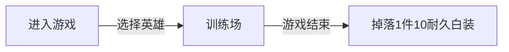
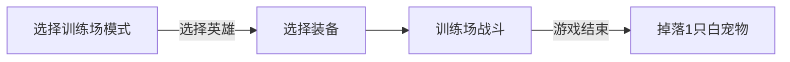
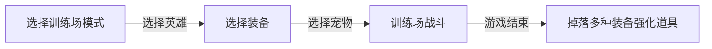
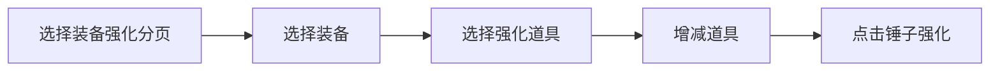

# 文字MUD游戏

---

## 仓库

存储玩家道具和标签货币

## 好友

好友多也是一种标签货币:)

## 邮件

系统发放使用

## 战队

影响房间战斗收益, 聊天频道

## 房间

游戏核心, 快乐的战斗之后, 产出各种标签货币、道具碎片, 战斗中只能和队友聊天(语音),
禁止一切机会和敌方聊天, 禁止串通作弊, 一旦出现奇怪的行动, 不攻击等, 视为作弊
对消极战斗, 全面给与惩罚, 全面给出打酱油, 评分低, 而且信用降低, 产生一次信用问题记录

## 大厅

各种系统的入口, 统计中心

## 标签货币

非常多, 从开服第一场战斗开始, 建立标签货币产出总值, 现存总值
货币的用途就是兑换钻石, 不管什么货币, 只要比上一个出价高(依据当时汇率), 就成功竞价
竞拍成功后, 规定时间内汇款, 否则流拍钻石回归拍卖场所
当前汇率是全服可见, 从最值钱的到最便宜的一次排列, 也就是总值从小到大排列, 每1分钟统计一次均值,
对于前面几种罕见货币, 进行录像审查, 审查后, 才能作为货币反馈
标签货币就是说 : 用游戏的过程赚钱, 付出就有回报, 不管是胜利还是失败, 大家都牛逼了, 失败就是最大赢家

## 下列是标签货币

货币名称|描述
--|--
集邮王|碎片收集足够多
吃货|一场战斗中吃的最多
好基友|一场战斗中助攻最多
技术达人|一场战斗中杀人最多
打酱油|一场战斗中, 啥成就也不突出
天使|一场战斗中, 死亡次数最少
开场秀|开战第一滴血
超神|10杀
我是第一|团队第一名

## 游戏系统


### 装备升阶


### 匹配流程


### 钻石矿 && 拍卖会

强调RMB玩家的钻石地位, 特别开通钻石矿, 强调钻石的作用和地位


---

## 主题

### 冒险 + 竞技

- 冒险
    > 场景随机, 各种随机触发陷阱, 有利和不利的都有, 可怕的草丛, 乌黑的山洞

- 竞技
    > 英雄自带装备+技能占1/3权重
    > 场景提供的道具和陷阱占1/3权重
    > 英雄走位占1/3权重
    > 英雄配合就是全部

---

## 主界面

- 帐号相关
  基本信息和统计系统

- 冒险模式
> 1. 组队/单排乱斗
>    背包     : 临时背包, 开始冒险为空, 玩家只能携带自身装备, 临时背包很小(6格), 拾取的道具放入临时背包
>    宠物     : 战斗前携带宠物, 冒险中不能切换宠物, 宠物可以携带装备
>    死亡惩罚 : 随机掉落1件装备, 优先掉落比赛中拾取的装备, 该装备耐久掉1, 队友拾取, 靠近自动归还掉落者, 敌人拾取就归敌人本场战斗使用
>    冒险结束 : 依据各种标记获取战利品, 归还拾取的玩家装备(装备损坏提醒玩家), 各种通货和奖牌(也是道具) 
> 2. 训练场
>    单机训练模式
> 3. 开房间
>    组队训练模式, 不能刷分, 不掉耐久, 不能带走产出道具, 只能产出"房卡"
>
 


- 钻石矿+拍卖会
    > 系统馈赠的钻石, 非R需要用游戏币竞价获取

- 仓库
    > 没有格子概念, 分页分类保存, 只有重量限制, 玩家可以购买重量

- 装备强化
    > 用通货和冒险获取的装备进行强化, 过程是个迷, 没有固定配方, 一切都是迷
    > 升阶强化非常重要, 将影响装备的最高耐久, 之后每次修理最高耐久就下降
    > 再好的装备用的多很快就报废, 无法使用

- 市场
    > 用通货交易装备和通货, 不能用同一类通货交换自身, 每个交易物品单独标价
    > 市场都是一口价
    > 查询物品( 物品, 通货, 价位, 品质, )


## 新手引导
- 英雄引导


- 装备引导


- 宠物引导


- 装备强化引导


- 实战引导  *可以省略装备和宠物的选择, 使用默认配置* 
```flow
st=>start: 开始
e=>end: 结束

cond1=>condition: 冒险?
cond2=>condition: 训练?
cond3=>condition: 开房间?

op1=>operation: 匹配
op2=>operation: 进入场景
op3=>operation: 选择一名英雄
op4=>operation: 选择队友
op5=>operation: 选择武器
op6=>operation: 选择宠物

xop1=>operation: 匹配
xop2=>operation: 进入场景
xop3=>operation: 选择一名英雄
xop4=>operation: 选择队友
xop5=>operation: 选择武器
xop6=>operation: 选择宠物

kop1=>operation: 匹配
kop2=>operation: 进入场景
kop3=>operation: 选择一名英雄
kop4=>operation: 选择队友
kop5=>operation: 选择武器
kop6=>operation: 选择宠物


st->cond1
cond1(yes)->op4->op3->op1->op5->op6->e
cond1(no)->cond2

cond2(yes)->xop4->xop3->xop5->xop6->e
cond2(no)->cond3

cond3(yes)->kop4->kop3->kop5->kop6->e


```

- **帐号仓库**
  按照道具分类显示, 可以自定义标签分页, 防止不同的道具, 没有标签的放入
  临时标签页
```ditaa {cmd=true args=["-E"]}
  +-------+
  | Depot |
  +-------+-----------------------+
  | MuJian                        |
  +-------+-------+-------+-------+
  |MuJian |MuJian |MuJian |MuJian |
  |  Wite | Blue  |       |       |
  +-------+-----------------------+
  | MuKui                         |
  +-------+-------+-------+-------+
  |MuKui  |MuKui  |MuKui  |MuKui  |
  |   Wite| Blue  |       |       |
  +-------+-----------------------+
  | TieJian                       |
  +-------+-------+-------+-------+
  |TieJian|TieJian|TieJian|TieJian|
  |   Wite| Blue  |       |       |
  +-------+-------+-------+-------+
  ```
